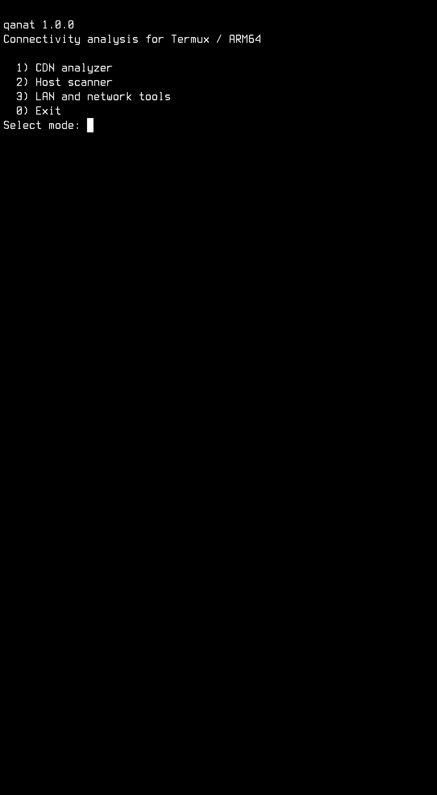
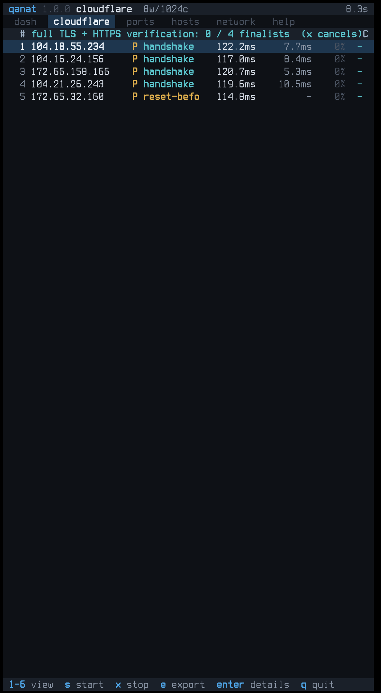

# قنات (Qanat)

**اسکن و تحلیل شبکه برای Android و Termux؛ سبک، بدون روت و آگاه از محدودیت‌های موبایل**

[English version](README.md)

> **فقط می‌خواهید برنامه را نصب و اجرا کنید؟** لازم نیست فعلاً بخش‌های فنی را
> بخوانید. مستقیم به [نصب در Termux](#install) و سپس
> [شروع سریع](#quick-start) بروید.

<a id="about"></a>
## قنات چیست؟

قنات یک ابزار خط فرمان برای **اسکن، اندازه‌گیری و مقایسهٔ مسیرهای شبکه** روی
گوشی اندرویدی است. برنامه داخل Termux و بدون دسترسی روت اجرا می‌شود و در یک
فایل اجرایی، تحلیل آدرس‌های IPv4 کلادفلر، اسکن پورت یک هاست، کشف دستگاه‌های
شبکهٔ محلی و بررسی وضعیت اتصال فعلی را کنار هم قرار می‌دهد.

نام پروژه از **قنات** گرفته شده است: مسیری که در زمین خشک، راه عبور آب را پیدا
می‌کند. این ابزار هم قرار نیست صرفاً انبوهی از آدرس‌ها را امتحان کند؛ تلاش
می‌کند میان یک فضای بزرگ، مسیرهایی را پیدا کند که از دید همین گوشی و همین
اتصال، پاسخ‌گوتر و پایدارتر به نظر می‌رسند.

قنات دو شیوهٔ استفاده دارد:

- **رابط تعاملی و منوی عددی:** برای شروع اسکن، تغییر تنظیمات و دیدن پیشرفت از
  داخل خود ترمینال.
- **حالت headless:** برای اجرای مستقیم فرمان‌ها، اسکریپت‌نویسی و ذخیرهٔ نتیجه
  در JSON یا CSV.

قنات خودش VPN، تونل یا پراکسی ایجاد نمی‌کند. کار آن **اندازه‌گیری و رتبه‌بندی
کاندیدها** است؛ نتیجه می‌تواند بعداً، با رعایت مجوز و قوانین سرویس، در تنظیمات
ابزار دیگری استفاده شود.

هسته با C11 نوشته شده و برای ARM64، از جمله دستگاه‌های Snapdragon و MediaTek،
مسیرهای بهینهٔ اختیاری دارد. هر مسیر assembly فقط پس از تشخیص قابلیت پردازنده
فعال می‌شود و نسخهٔ قابل‌حمل C همیشه به‌عنوان fallback باقی می‌ماند.

**قنات فقط چیزی را گزارش می‌کند که همان دستگاه، روی همان مسیر و در همان لحظه
مشاهده کرده است.** نتیجه ممکن است با اپراتور، وای‌فای، VPN، مکان، شلوغی شبکه،
دمای گوشی و زمان تغییر کند. یک نتیجه به‌تنهایی اثبات دسترسی یا مسدود بودن در
کل یک شهر یا کشور نیست.

## فهرست مطالب

- [قنات چیست؟](#about)
- [چرا قنات ساخته شد؟](#why)
- [محیط هدف و وابستگی‌ها](#environment)
- [قابلیت‌ها](#capabilities)
- [سرعت و منطق اسکن](#scan-engine)
- [نصب و بیلد در Termux](#install)
- [شروع سریع](#quick-start)
- [اسکنر IPv4 کلادفلر](#cloudflare)
- [خروجی، محدودیت‌ها و استفادهٔ مسئولانه](#output)
- [زبان‌ها و فناوری‌ها](#technology)
- [امنیت، مشارکت و مجوز](#security)

## اگر اولین بار است از قنات استفاده می‌کنید

این مسیر کوتاه برای شروع کافی است:

1. فرمان‌های بخش **نصب و بیلد در Termux** را خط‌به‌خط اجرا کنید.
2. با `./build/qanat doctor` سازگاری بیلد و محیط را بررسی کنید.
3. برنامه را بدون آرگومان اجرا کنید تا منوی عددی باز شود: `./build/qanat`
4. برای بررسی اتصال فعلی از `./build/qanat --net --headless` استفاده کنید.
5. برای یک هاست، ابتدا پورت‌های رایج را با `-p top` بررسی کنید.
6. در اسکن کلادفلر با حالت **Auto** یا یک Coverage کوچک شروع کنید و پیش از
   تأیید، Scan Plan و مصرف تخمینی منابع را بخوانید.

نمونهٔ آمادهٔ هرکدام در بخش [شروع سریع](#quick-start) آمده است.

<a id="why"></a>
## چرا قنات ساخته شد؟

یکی از مسئله‌های واقعی در اینترنت ایران این است که کیفیت مسیر رسیدن به CDNها
برای همهٔ اپراتورها، شبکه‌ها و لحظه‌ها یکسان نیست. بسیاری از پیکربندی‌های
تونل یا پراکسی به زیرساخت کلادفلر وابسته‌اند و یک آدرس که روی یک اتصال خوب
کار می‌کند ممکن است روی اتصال دیگر کند، ناپایدار یا کاملاً بی‌پاسخ باشد.
بنابراین داشتن یک فهرست ثابت از IPها کافی نیست؛ باید از روی همان گوشی و همان
مسیر اندازه‌گیری کرد.

اسکنرهای عمومی و ابزارهای نوشته‌شده با زبان‌های سطح بالا می‌توانند برای کار
خودشان کاملاً مناسب باشند؛ مسئله این است که مدل اجرایی بسیاری از آن‌ها برای
گوشی طراحی نشده است. در سوی دیگر، ابزارهای قدرتمند دسکتاپ مانند ZMap و masscan
معمولاً از packet خام، دسترسی سطح بالاتر و بودجهٔ بزرگ FD و conntrack سود
می‌برند. این فرض‌ها روی Android بدون روت یا در شبکهٔ موبایل همیشه برقرار نیست.

قنات مدل یک سرور چندده‌هسته‌ای را روی گوشی کپی نمی‌کند. موتور آن از
`connect()` غیرمسدودکننده، `epoll` با fallback مبتنی بر `select()`، پنجرهٔ
محدود اتصال و کنترل AIMD استفاده می‌کند. وقتی تأخیر، timeout یا فشار منابع
بالا برود، برنامه می‌تواند سرعت شروع اتصال‌های تازه را کم کند تا NAT، جدول
اتصال‌ها و خود دستگاه را اشباع نکند.

هدف پروژه یک عدد نمایشی و لحظه‌ای برای «IP در ثانیه» نیست؛ هدف، رسیدن به
**اندازه‌گیری سریع، قابل‌تکرار و قابل‌توضیح روی سخت‌افزار واقعی موبایل** است.

<a id="environment"></a>
## محیط هدف و وابستگی‌ها

| مورد | وضعیت |
| --- | --- |
| محیط اصلی | گوشی Android ARM64 و Termux، بدون روت |
| محیط ثانویه | Linux/POSIX برای توسعه و تست؛ دسکتاپ هدف اصلی محصول نیست |
| زبان | C11 و assembly محدود AArch64 |
| نیاز بیلد | `clang` و `make` |
| ابزارهای کمکی | `git` برای دریافت سورس، `curl` برای به‌روزرسانی رنج‌ها و `openssl` فقط برای تست محلی TLS |
| وابستگی اجرایی | هستهٔ برنامه به کتابخانهٔ شخص ثالث لینک نمی‌شود و بر libc، pthread و رابط‌های Linux/POSIX تکیه دارد |
| دسترسی ویژه | برای بیلد، نصب و حالت‌های اصلی اسکن به روت نیاز نیست |

پس از ساخت، اجرای حالت‌های اصلی به Python، Go، JVM یا یک framework جداگانه
وابسته نیست. تنها قابلیت **به‌روزرسانی خودکار فهرست رنج‌ها** برنامهٔ `curl` را
فراخوانی می‌کند؛ `openssl` نیز وابستگی برنامه نیست و فقط در ماتریس تست توسعه
استفاده می‌شود.

<a id="capabilities"></a>
## قابلیت‌ها

| حالت | کاربرد |
| --- | --- |
| `qanat` | باز کردن منوی عددی و انتخاب حالت بدون حفظ کردن گزینه‌های خط فرمان |
| `--cf` | پیدا کردن آدرس‌های پاسخ‌گوی IPv4 کلادفلر و مرتب کردن آن‌ها بر اساس کیفیت اتصال |
| `--ports HOST` | بررسی پورت‌های انتخابی یا تمام ۶۵٬۵۳۵ پورت TCP یک هاست IPv4 یا IPv6 |
| `--discover [CIDR]` | پیدا کردن دستگاه‌های پاسخ‌گو در شبکهٔ محلی IPv4 |
| `--net` | نمایش خلاصهٔ رابط شبکه، مسیر، DNS، آدرس عمومی و تأخیر اتصال |
| `doctor` | نمایش وضعیت بیلد، معماری، CPU، بودجهٔ منابع و قابلیت‌های محلی بدون اجرای اسکن عمومی |
| `fingerprint list/show/diff` | دیدن و مقایسهٔ پروفایل‌های TLS/HTTP که verifier استفاده می‌کند |

ویژگی‌های پایه:

- **بدون نیاز به روت:** از اتصال‌های عادی TCP استفاده می‌کند؛ در صورت اجازهٔ اندروید، ping بدون روت را هم امتحان می‌کند.
- **هستهٔ اجرایی مستقل:** حالت‌های اصلی به کتابخانهٔ شخص ثالث لینک نمی‌شوند؛ فقط به‌روزرسانی رنج‌ها به `curl` نیاز دارد.
- **دو رابط:** TUI برای کار تعاملی و headless برای خروجی ساده، اسکریپت و ذخیره در فایل.
- **مصرف کنترل‌شدهٔ منابع:** تعداد اتصال‌ها و حافظه محدود می‌ماند تا گوشی و شبکه زیر فشار ناگهانی قرار نگیرند.
- **خروجی قابل ذخیره:** نتیجه را می‌توان به‌شکل JSON، CSV، گزارش رویداد و سابقهٔ اختیاری نگه داشت.

## نمای برنامه روی گوشی

<table>
  <tr>
    <td align="center"></td>
    <td align="center"></td>
  </tr>
  <tr>
    <td align="center"><strong>منوی سادهٔ عددی</strong></td>
    <td align="center"><strong>نمای زندهٔ اسکن و verification</strong></td>
  </tr>
</table>

تصاویر روی گوشی Android و داخل Termux ثبت شده‌اند. بقیهٔ تصاویر در
[پوشهٔ screenshots](docs/screenshots/README.md) قرار دارند.

## چرا طراحی قنات موبایل‌محور است

اسکنری که برای دسکتاپ ساخته شده می‌تواند با باز کردن هزاران اتصال، روی گوشی نتیجهٔ برعکس بدهد: جدول اتصال‌های اندروید یا اپراتور پر می‌شود، گوشی داغ می‌کند و سرعت واقعی پایین می‌آید. قنات این محدودیت‌ها را از ابتدا در طراحی خود در نظر می‌گیرد:

- **فشار اتصال‌ها:** اندروید و شبکهٔ موبایل برای اتصال‌های باز جدول محدودی دارند. قنات سقف امن‌تری انتخاب می‌کند و الگوریتم AIMD با زیاد شدن تأخیر یا خطا، فشار اسکن را خودکار کم می‌کند.
- **هسته‌های سریع و کم‌مصرف:** پردازنده‌های Snapdragon، MediaTek و تراشه‌های مشابه چند نوع هسته دارند. قنات خوشه‌های CPU را تشخیص می‌دهد و در حد اجازهٔ اندروید، کارهای شبکه را روی هسته‌های مناسب‌تر قرار می‌دهد.
- **گرمای دستگاه:** اگر کرنل اجازهٔ خواندن حسگرها را بدهد و دمای گزارش‌شده بالا برود، برنامه تعداد اتصال‌های هم‌زمان را کاهش می‌دهد تا افت شدید فرکانس کمتر شود.
- **خواب مودم:** مودم موبایل ممکن است پیش از اولین اندازه‌گیری در حالت کم‌مصرف باشد. قنات مسیر را کوتاه گرم می‌کند تا تأخیر بیدار شدن مودم کمتر وارد نتیجه شود؛ این رفتار با `--no-warm` خاموش می‌شود.
- **هزینهٔ نمایش در Termux:** TUI فقط بخش‌های تغییرکردهٔ صفحه را دوباره می‌نویسد. حالت headless حتی همین هزینه را هم ندارد.
- **بهینه‌سازی ARM64:** روی AArch64، مسیرهای AES/PMULL، SHA-256/512، ChaCha20 و Poly1305 در صورت پشتیبانی پردازنده انتخاب می‌شوند و نسخهٔ معمول C نیز همیشه وجود دارد.

قنات یک raw-packet blaster نیست. هدف آن **اندازه‌گیری سریع، پایدار و کنترل‌شده روی گوشی بدون روت** است؛ بدون اینکه خود دستگاه یا مسیر شبکه زیر بار غیرمنطقی فروبپاشد.

<a id="scan-engine"></a>
## سرعت و منطق اسکن

سرعت قنات یک عدد ثابت نیست. نوع اتصال، سکوت یا پاسخ سریع مقصد، timeout، تعداد
retry، دمای گوشی، محدودیت‌های اپراتور و Scan Plan همگی روی زمان نهایی اثر
دارند. به همین دلیل پروژه بدون ذکر مدل دستگاه، تنظیمات و شرایط آزمایش ادعای
عمومی «چند میلیون IP در ثانیه» مطرح نمی‌کند.

قنات سرعت را از چند تصمیم معماری به دست می‌آورد:

- سوکت‌ها blocking نیستند؛ هر worker تعداد زیادی اتصال را با event loop و
  `epoll` مدیریت می‌کند.
- برای هر probe تخصیص حافظهٔ آزاد و رهاشونده انجام نمی‌شود؛ slotها، arenaها،
  ringها و timeout wheel از قبل محدود و قابل‌حساب‌اند.
- موتور sweep ارزان از verification سنگین TLS/HTTP جداست؛ فقط کاندیدهای بهتر
  وارد مرحلهٔ پرهزینه می‌شوند.
- Top-K streaming اجازه می‌دهد بدون نگه داشتن تمام پاسخ‌ها در RAM، گزینه‌های
  امیدوارکننده حفظ شوند.
- حالت‌های Coverage، Budget و Reachable Target می‌توانند به‌جای پیمایش کور کل
  فضا، مقدار کاری را که واقعاً لازم است مشخص کنند.
- AIMD با دیدن timeout، افزایش تأخیر یا فشار محلی پنجرهٔ اتصال را پایین
  می‌آورد؛ وقتی شرایط آرام است آن را تدریجی بالا می‌برد.
- حالت headless هزینهٔ رسم رابط ترمینال را حذف می‌کند.

در اسکن کلادفلر، روند کلی چنین است:

1. **Plan:** رنج‌ها نرمال می‌شوند و بودجهٔ آدرس، حافظه، FD و concurrency پیش
   از اولین اتصال حل می‌شود.
2. **Sweep:** آدرس‌ها مطابق روش انتخاب‌شده با TCP/443 بررسی می‌شوند.
3. **Retain:** بهترین کاندیدهای مشاهده‌شده در یک ساختار حافظه‌محدود نگه داشته
   می‌شوند.
4. **Measure و Verify:** گروه برگزیده دوباره اندازه‌گیری می‌شود و سپس TLS و
   HTTP/1.1 یا HTTP/2 را در batchهای محدود طی می‌کند.
5. **Rank:** تأخیر، loss، نوسان، پایداری، شواهد edge و throughput اختیاری به
   امتیاز نسخه‌دار و خروجی نهایی تبدیل می‌شوند.

این تعریف پروژه از سرعت است: **کار بیهودهٔ کمتر، فشار کنترل‌شده‌تر و نتیجه‌ای
که بتوان توضیح داد چگونه به دست آمده است.**

## نمای کلی معماری برای کاربران فنی

مسیر sweep سبک از مسیر verification سنگین جدا شده است:

```text
prefixها / portها
      |
      v
ترتیب تطبیقی یا permutation کلیددار
      |
      v
pthread workers -> epoll/select -> non-blocking sockets -> timeout wheel
      |                                      |
      +---------- per-worker SPSC rings -----+
                                             |
                                             v
                                      owner thread
                                             |
                        +--------------------+--------------------+
                        |                    |                    |
                       TUI                headless             JSON/CSV

Cloudflare finalists -> bounded epoll verifier -> TLS 1.3/1.2
                     -> HTTP/2 یا HTTP/1.1 -> trace/flow/idle checks
```

در اسکن کلادفلر، زمان‌بند تطبیقی ابتدا بخش‌های مختلف رنج را امتحان می‌کند و بعد توجه بیشتری به بخش‌های امیدوارکننده می‌دهد. ساختار Top-K فقط بهترین گزینه‌ها را در حافظه نگه می‌دارد و نمونه‌گیری ترتیبی، وقتی برای رتبه‌بندی یک آدرس شواهد کافی وجود دارد، اندازه‌گیری‌های اضافی را متوقف می‌کند.

برای جزئیات، [معماری](docs/ARCHITECTURE.md)، [معماری Scan Plan](docs/SCAN-PLAN.md)، [اندازه‌گیری و کارایی](docs/PERFORMANCE.md) و [مرز اعتماد TLS](docs/TLS.md) را بخوانید.

<a id="install"></a>
## نصب و بیلد در Termux

دستورهای زیر را **خط‌به‌خط** اجرا کنید و صبر کنید هر خط کامل شود:

```bash
pkg update -y
pkg install -y clang make git curl
git clone https://github.com/EntropyRoot/Qanat-Scanner.git
cd Qanat
make NATIVE=1
./build/qanat --version
./build/qanat doctor
```

گزینهٔ `NATIVE=1` روی گوشی ARM64، فلگ `-mcpu=native` را فعال می‌کند. بیلد release همچنین از `-O3`، حذف sectionهای بدون استفاده و ThinLTO در Clang استفاده می‌کند.

برای استفادهٔ عادی به OpenSSL نیاز ندارید. اگر می‌خواهید تست محلی TLS
توسعه‌دهندگان را نیز اجرا کنید، آن را جدا نصب کنید:

```bash
pkg install -y openssl
```

برای نصب فایل اجرایی در مسیر فرمان‌های Termux:

```bash
make install
qanat --version
```

برای بیلد و نصب به روت نیاز نیست.

### بیلد از فایل ZIP محلی

ZIP را به حافظهٔ قابل دسترسی Termux منتقل کنید، از حالت فشرده خارج شوید و داخل پوشهٔ سورس بیلد بگیرید:

```bash
pkg install -y clang make unzip
unzip Qanat-source.zip
cd Qanat-source
make NATIVE=1
./build/qanat --version
```

نام ZIP و پوشه را متناسب با فایل خودتان تغییر دهید.

### رفع خطای `Continue?` و سپس `Abort`

فرمان بعدی را به‌عنوان پاسخ prompt مدیر بسته paste نکنید. همان‌طور که بالا نوشته شده از `-y` استفاده کنید و پایان هر فرمان را جداگانه منتظر بمانید. اگر مشکل از mirror یا repository است:

```bash
termux-info
termux-change-repo
pkg update -y
pkg install -y clang make git curl
```

در `termux-change-repo` یک mirror قابل‌دسترسی برای مخزن اصلی انتخاب کنید و سپس به دستورهای بیلد برگردید. اگر خطا ادامه داشت، خروجی کامل از اولین خطا تا `Abort` را نگه دارید.

### گزینه‌های بیلد و تست برای توسعه‌دهندگان

| فرمان | کاربرد |
| --- | --- |
| `make` | بیلد release بهینه و قابل‌حمل |
| `make NATIVE=1` | بیلد release تنظیم‌شده برای ARM64 همان گوشی |
| `make strict` | بیلد با `-Werror` و بررسی سخت‌گیرانهٔ conversionها |
| `make test` | تست‌های قطعی هسته، رمزنگاری، engine، verifier، export، parserهای TLS و propertyها |
| `make offline-test` | suite قطعی که هیچ socket شبکهٔ واقعی باز نمی‌کند |
| `make strict-offline-test` | اجرای allowlist آفلاین با warningهای fatal |
| `make sanitize-offline-test` | allowlist آفلاین زیر ASan و UBSan |
| `make tsan-offline-test` | allowlist آفلاین زیر ThreadSanitizer در محیط سازگار |
| `make menu-test` | هدایت منوی عددی داخل pseudo-terminal واقعی |
| `make tls-test` | ماتریس handshake محلی TLS 1.2/1.3 در برابر OpenSSL |
| `make analyze` | بیلد کل برنامه با تحلیل‌گر path-sensitive در GCC |
| `make check` | strict build، همهٔ suiteها، تست PTY منوی عددی و ماتریس OpenSSL |
| `make debug` | بیلد برنامه با ASan و UBSan |
| `make sanitize-test` | اجرای تست‌ها زیر ASan و UBSan |
| `make tsan-test` | اجرای تست‌ها زیر ThreadSanitizer در toolchain لینوکسی سازگار |
| `make fuzz` | ساخت targetهای libFuzzer با Clang |

اگر ThinLTO در toolchain سفارشی شما در دسترس نبود:

```bash
make NATIVE=1 LTO=
```

<a id="quick-start"></a>
## شروع سریع

در مثال‌ها از `./build/qanat` استفاده شده است. پس از `make install` می‌توانید آن را با `qanat` جایگزین کنید.

### منوی عددی

برنامه را داخل ترمینال بدون آرگومان اجرا کنید:

```bash
./build/qanat
```

منوی اصلی سه گزینه دارد: `1) تحلیل‌گر CDN`، `2) اسکنر هاست` و `3) ابزارهای LAN و شبکه`. صفحهٔ مستقل **Scan Plan / تنظیمات اسکن** در بخش CDN، بدون نیاز به CLI، حالت Auto، Full، Percentage، Fixed Budget و Reachable Target؛ روش selection؛ ظرفیت candidate؛ تعداد کل finalist شامل All؛ Output Top؛ سه concurrency مستقل؛ ranking و memory budget را ویرایش و ذخیره می‌کند. پیش از شروع، rangeهای نرمال‌شده، overlap حذف‌شده، حافظه، FD، batch و plan مؤثر نمایش داده می‌شوند. Full بسیار بزرگ تأیید صریح می‌خواهد.

این launcher فقط زمانی فعال می‌شود که ورودی و خروجی استاندارد هر دو TTY باشند؛ script، pipe و redirect همچنان از CLI/headless استفاده می‌کنند.

### بررسی وضعیت شبکهٔ فعلی

```bash
./build/qanat --net --headless
```

ذخیرهٔ گزارش JSON:

```bash
./build/qanat --net --headless --json network.json
```

### اسکن یک هاست

اسکن پورت‌های رایج:

```bash
./build/qanat --ports example.com -p top --headless
```

اسکن فهرست و بازهٔ دلخواه:

```bash
./build/qanat --ports 192.168.1.10 -p 22,80,443,8000-8100 --headless
```

اسکن تمام ۶۵٬۵۳۵ پورت TCP روی هدفی که اجازهٔ بررسی آن را دارید:

```bash
./build/qanat --ports 192.168.1.10 -p all --headless --json ports.json
```

مشخصهٔ `-` با `all` برابر است. اگر `-p` ننویسید نیز پیش‌فرض، تمام پورت‌هاست.

ترجیح IPv6 هنگام resolve کردن یک هاست:

```bash
./build/qanat --ports example.com --ipv6 -p 80,443 --headless
```

در خروجی متنی فقط پورت‌هایی چاپ می‌شوند که باز بودنشان تأیید شده است. فایل JSON تعداد پورت‌های بررسی‌شده، بسته و بدون پاسخ را هم نگه می‌دارد. پاسخ `refused` یعنی دستگاه مقصد در دسترس بوده، اما آن پورت بسته است. بی‌پاسخ ماندن الزاماً به معنی بسته بودن نیست؛ فایروال یا اختلال مسیر هم می‌تواند همان نتیجه را بسازد.

### چرا اسکن کامل پورت ممکن است زمان‌بر باشد

برنامه به‌طور پیش‌فرض برای هر مرحله تا ۱۲۰۰ میلی‌ثانیه منتظر می‌ماند و پورت‌های بی‌پاسخ را یک بار دیگر بررسی می‌کند. بنابراین هدفی که بیشتر درخواست‌ها را بی‌صدا رها می‌کند، بسیار دیرتر از هدفی تمام می‌شود که سریع جواب «پورت بسته است» می‌دهد. قنات در صورت زیاد شدن بی‌پاسخی، تعداد اتصال‌های هم‌زمان را نیز کاهش می‌دهد تا نتیجه‌های اشتباه کمتر شوند.

برای یک هدف مجاز و کم‌تأخیر داخل LAN می‌توان تهاجمی‌تر شروع کرد:

```bash
./build/qanat --ports 192.168.1.10 -p all \
  --timeout 400 --retries 0 --headless
```

این تنظیمات را بدون اندازه‌گیری روی اینترنت موبایل یا مسیرهای پرتأخیر کپی نکنید.

<a id="cloudflare"></a>
## اسکنر IPv4 کلادفلر

اسکن انبوه کلادفلر عمداً IPv4 است. پیمایش فراگیر prefixهای IPv6 از نظر عملی معنا ندارد؛ IPv6 همچنان در port scanner تک‌هاست پشتیبانی می‌شود.

### به‌روزرسانی فهرست رنج‌ها

برنامه برای شروع سریع یک snapshot داخلی دارد. cache مدیریت‌شده را این‌گونه به‌روز کنید:

```bash
./build/qanat --update-ranges
```

updater فقط HTTPS را می‌پذیرد، زمان و اندازه را محدود می‌کند، فهرست malformed، IPv6، تکراری، overlapping یا غیرعادی کوچک را رد می‌کند و فایل موقت کاملاً اعتبارسنجی‌شده را به‌صورت atomic در `${XDG_CACHE_HOME:-$HOME/.cache}/qanat/cloudflare-v4.txt` نصب می‌کند. اجرای بعدی `--cf` خودکار از cache معتبر استفاده می‌کند؛ برای فایل سفارشی همچنان `--ranges` را بدهید.

اجرای plan خودکار:

```bash
./build/qanat scan cf --scan-mode auto --headless --json cf-results.json
```

Plan مؤثر پیش از اولین probe چاپ می‌شود. traversal، selection، ظرفیت candidate، تعداد کل finalist، تعداد خروجی و concurrencyها مستقل‌اند:

```bash
# تمام آدرس‌های یکتای همهٔ rangeهای بارگذاری‌شده، دقیقاً یک بار.
./build/qanat scan cf --scan-mode full --headless

# دقیقاً ceil(10% از آدرس‌های یکتا) با Hybrid.
./build/qanat scan cf --scan-mode coverage --coverage 10% \
  --selection hybrid --headless

# دقیقاً min(250000, total unique) attempt.
./build/qanat scan cf --scan-mode budget --address-budget 250000 --headless

# پایان موفق پس از retained شدن 4096 کاندید reachable.
./build/qanat scan cf --scan-mode reachable --reachable-target 4096 --headless

# Candidate بزرگ و Finalist مستقل.
./build/qanat scan cf --scan-mode coverage --coverage 10% \
  --candidate-cap 65536 --finalists 256 --verify-concurrency 32 \
  --output-top 100 --memory-budget 256MiB --headless

# تمام candidateهای retained در batchهای محدود verify می‌شوند.
./build/qanat scan cf --scan-mode budget --address-budget 250000 \
  --candidate-cap 65536 --finalists all --verify-concurrency 32 \
  --output-top all --memory-budget 512MiB --headless
```

درصد با عدد fixed-point از ۰٫۰۱ تا ۱۰۰ parse می‌شود و ۱۰۰٪ دقیقاً Full است. Full، prefixهای overlap را نرمال می‌کند و هر آدرس یکتا را یک بار attempt می‌کند. progress حالت Percentage و Budget نسبت به planned addresses است؛ Reachable هم پیشرفت target و هم coverage واقعی را نشان می‌دهد.

Hybrid پیش‌فرض است: exploration تضمین‌شدهٔ stratified پیش از exploitation تطبیقی انجام می‌شود. Uniform و Stratified نسبت به sample برنامه‌ریزی‌شده representative هستند؛ Adaptive و Hybrid نیستند. هر خروجی partial با عبارت **«بهترین مشاهده‌شده میان آدرس‌های اسکن‌شده»** مشخص می‌شود.

Candidate Capacity حافظهٔ streaming برای endpointهای امیدوارکننده است، نه بودجهٔ attempt. Finalists تعداد کل endpointهای بررسی عمیق‌اند، نه Verify Concurrency. بنابراین `--finalists 1024 --verify-concurrency 32` معتبر است و هر ۱٬۰۲۴ مورد را batch-based بررسی می‌کند. `--output-top` فقط تعداد نمایش/export را تغییر می‌دهد.

`--cf` برای سازگاری باقی مانده و بدون `--limit` همان intent پیمایش کامل قدیمی را حفظ می‌کند. `--limit N` deprecated است و به `--scan-mode reachable --reachable-target N` map می‌شود؛ optionهای scope قدیمی و جدید متناقض با خطای دقیق رد می‌شوند.

### بررسی عمیق همراه با history

حالت deep پیش‌فرض است. این حالت TLS را کامل می‌کند، روی همان اتصال رمزگذاری‌شدهٔ پورت ۴۴۳ مسیر `/cdn-cgi/trace` را می‌خواند و اتصال را به‌اندازهٔ idle تعیین‌شده نگه می‌دارد:

```bash
./build/qanat scan cf \
  --ranges cloudflare-v4.txt \
  --sni www.cloudflare.com \
  --deep \
  --scan-mode reachable --reachable-target 128 \
  --candidate-cap 4096 --finalists 128 --output-top 20 \
  --samples 5 \
  --idle 5000 \
  --fingerprint chrome \
  --history qanat-history.tsv \
  --event-log qanat-events.tsv \
  --headless \
  --json cf-results.json
```

`--quick` همچنان handshake کامل TLS و درخواست HTTPS trace را انجام می‌دهد؛ فقط مرحلهٔ انتقال اختیاری و idle hold را غیرفعال می‌کند.

فایل history برای شواهد نیمه‌عمر سه‌روزه در نظر می‌گیرد. تأیید تازه و تکرارشده، مخصوصاً روی بیش از یک path tag محلی، از یک مشاهدهٔ قدیمی و منفرد وزن بیشتری می‌گیرد. `--seed` ترتیب هدف‌ها و تصادفی‌بودن handshake را قابل تکرار می‌کند، اما ترتیب پاسخ شبکه و زمان‌بندی تطبیقی باعث می‌شوند دو اجرای زنده الزاماً مجموعهٔ کاملاً یکسانی نداشته باشند.

`--samples N` بودجهٔ نمونه‌گیری ترتیبی RTT را کنترل می‌کند و الزاماً دقیقاً N probe اجرا نمی‌کند. یک فینالیست نامشخص ممکن است تا `min(12, 2 × N)` دور اندازه‌گیری بگیرد، اما موارد روشن زودتر متوقف می‌شوند. verifier کامل حتی اگر timeout مرحلهٔ sweep کمتر باشد، حداقل deadline برابر ۸۰۰۰ میلی‌ثانیه دارد.

### نمونهٔ اختیاری throughput

انتقال حجیم به‌صورت پیش‌فرض خاموش است و SNI باید مسیر تولیدشده را سرو کند. برای endpoint سرعت کلادفلر:

```bash
./build/qanat scan cf \
  --ranges cloudflare-v4.txt \
  --sni speed.cloudflare.com \
  --flow-bytes 262144 \
  --scan-mode reachable --reachable-target 64 \
  --candidate-cap 4096 --finalists 64 \
  --deep \
  --headless \
  --event-log qanat-events.tsv
```

`--flow-bytes` از صفر تا ۱۶ مگابایت را می‌پذیرد. این نتیجه یک نمونهٔ کوتاه در لایهٔ کاربرد است و benchmark عمومی سرعت خط محسوب نمی‌شود.

### مراحل بررسی نهایی

1. **Sweep:** traversal بدون duplicate روی TCP/443 مطابق selection policy مؤثر.
2. **Retain:** Top-K streaming و oversampled، candidateهای امیدوارکننده را تا ظرفیت plan نگه می‌دارد.
3. **Screen:** ClientHello دقیق profile immutable فقط pathهای TLS واقعاً پشتیبانی‌شده را می‌سنجد.
4. **Calibrate:** cohort متنوع و بزرگ‌تر از finalist دوباره نمونه‌گیری می‌شود تا یک minimum خوش‌شانس برنده نشود.
5. **Select:** median، p90، loss، jitter، stability، confidence و tie-break قطعی finalistهای کل را انتخاب می‌کنند.
6. **Verify:** finalistها در batchهای محدود TLS و HTTP را عمیق بررسی می‌کنند؛ recordها و peer `Finished` authenticate می‌شوند.
7. **Rank:** evidence مربوط به marker، latency robust، stability، confidence و throughput اختیاری وارد componentهای score versioned می‌شود و سپس Output Top اعمال می‌شود.

پروفایل‌های ClientHello:

```bash
--fingerprint chrome
--fingerprint firefox
--fingerprint safari
--fingerprint random
```

یک `qn_profile_instance` immutable مشترک، wire واقعی ClientHello، JA3/JA4 preview، تنظیمات HTTP/2، شکل HTTP/1، verifier و metadata خروجی را می‌سازد. profileهای داخلی فقط cipher، group، key share، signature algorithm، ALPN و مسیر retry پیاده‌سازی‌شده را advertise می‌کنند. `fingerprint list/show/diff` همین قرارداد را نشان می‌دهند؛ profile، seed و SNI یکسان preview و wire یکسان می‌سازند.

### معنی نتیجه‌ها و مرز اعتماد

| نتیجه | مشاهدهٔ انجام‌شده |
| --- | --- |
| `dead` | اتصال TCP قابل استفاده ساخته نشد |
| `local-error` | خطای syscall، descriptor، allocation یا event loop محلی مانع نتیجه‌گیری شبکه شد |
| `inconclusive` | وضعیت route یا مسیر برای attribution کافی نبود؛ برای نمونه unreachable بودن شبکه |
| `peer-rejected` | peer با refusal، alert، hangup یا EOF زودهنگام TLS پشتیبانی‌شده را رد کرد |
| `unsupported` | peer یک شکل معتبر ولی پشتیبانی‌نشدهٔ پروتکل را انتخاب کرد |
| `protocol-invalid` | توالی TLS/protocol malformed یا خارج از ترتیب بود، یا authentication رکورد/`Finished` شکست خورد |
| `reset-before-tls` | پیش از کامل شدن TLS پشتیبانی‌شده reset دیده شد |
| `timeout-before-tls` | connect یا handshake پشتیبانی‌شده پیش از deadline کامل نشد |
| `interference-suspected` | برای evidence چندسیگناله و corroborated رزرو شده است؛ timeout یا reset به‌تنهایی این verdict را نمی‌گیرد |
| `tcp` | TCP وصل شد، اما بررسی بعدی کامل نشد |
| `handshake` | handshake پشتیبانی‌شدهٔ TLS کامل شد و مقدار `Finished` سمت مقابل درست بود |
| `cf-marker-observed` | نشانگر کاربردی کلادفلر روی HTTPS همان اتصال پورت ۴۴۳ دیده شد |
| `flowing-after-marker` | انتقال محدود درخواستی پس از مشاهدهٔ marker کامل شد |
| `stable-after-marker` | اتصال پس از مشاهدهٔ marker از idle hold تعیین‌شده عبور کرد |

**کلاینت TLS زنجیرهٔ گواهی، hostname، تاریخ‌ها، revocation یا امضای CertificateVerify را اعتبارسنجی نمی‌کند.** درست بودن `Finished`، اشتراک کلیدهای handshake را نشان می‌دهد؛ نه هویت کلادفلر و نه نبود interception را. برای مشاهدهٔ CDN، `cf-marker-observed` یا rung بالاتر مبتنی بر marker را لازم بدانید. `stable-after-marker` همچنان فقط دوام idle را اندازه می‌گیرد.

verdictهای شکست فقط observation را توصیف می‌کنند، نه سانسور یا علت آن. firewall، رفتار سرور، شلوغی، CGNAT، تغییر route، packet loss و مداخلهٔ فعال می‌توانند نشانه‌های مشابه بسازند. فیلدهای مستقل `failure_origin`، `transport_result`، `tls_outcome`، `sys_errno` و `reason` evidence طبقه‌بندی را نگه می‌دارند.

پیش از استفادهٔ پژوهشی یا عملیاتی از نتایج، [محدوده و محدودیت‌های TLS](docs/TLS.md) را بخوانید.

### استفاده از کاندیدهای تأییدشده در Xray یا sing-box

پس از اسکن کلادفلر می‌توان یک template عمداً ناقص ساخت:

```bash
./build/qanat scan cf \
  --sni tunnel.example.com \
  --quick --scan-mode reachable --reachable-target 128 \
  --candidate-cap 4096 --finalists 128 --headless \
  --export xray --export-file xray-template.json
```

exporterهای `list`، `xray` و `singbox` فقط رکوردی را وارد می‌کنند که deep verification آن کامل شده و verdict آن `cf-marker-observed` یا بالاتر باشد. نتیجهٔ handshake-only، timeout، reset، unsupported یا preliminary هرگز به template تونل ارتقا داده نمی‌شود.

این فایل credential آماده یا تضمین سلامت Origin نیست. SNI/Host باید دامنه‌ای باشد که خودتان کنترل کرده و روی CDN به Origin درست متصل کرده‌اید؛ اگر اسکن با `www.cloudflare.com` پیش‌فرض انجام شده باشد، exporter عمداً `REPLACE_SNI` می‌نویسد. `REPLACE_UUID` و `REPLACE_PATH` را نیز جایگزین کنید و اگر deployment شما XHTTP، gRPC یا transport دیگری دارد، بخش WebSocket تولیدشده را متناسب تغییر دهید. این IPهای CDN مقصد عمومی REALITY نیستند. قنات مسیر marker کلادفلر را می‌سنجد، نه authentication خصوصی تونل یا route داخلی Origin شما را.

## کشف شبکهٔ محلی IPv4

تشخیص خودکار prefix فعال:

```bash
./build/qanat --discover --headless
```

یا تعیین مستقیم CIDR:

```bash
./build/qanat --discover 192.168.1.0/24 --headless --json hosts.json
```

بازهٔ پذیرفته‌شده `/16` تا `/32` است. قنات ابتدا ICMP echo بدون روت را امتحان می‌کند. اگر کرنل یا sandbox اندروید اجازه ندهد، چند probe روی پورت‌های رایج با TCP، کشف ARP-less را ادامه می‌دهند.

## رابط تعاملی TUI

پس از شروع mode از منوی عددی، TUI صفحهٔ Scan Plan، resource preflight، progress و export را نگه می‌دارد. decoder ورودی byteهای تایپ سریع و paste را در ring صف می‌کند و escape split، SS3، UTF-8، ورودی malformed و bracketed paste را incremental می‌خواند. renderer فقط پس از write کامل frame، مدل front را commit می‌کند و resize یا ترمینال کوچک را موفق جعل نمی‌کند. verifier کلادفلر finalistهای ثابت را batch-based بررسی می‌کند؛ `x` outcome تایپ‌شدهٔ User Cancelled می‌سازد و evidence تسویه‌شده را بدون race نگه می‌دارد.

```bash
./build/qanat --ports 192.168.1.10 -p top --tui
```

| کلید | عملکرد |
| --- | --- |
| `1` تا `6` و `Tab` | جابه‌جایی بین نماها |
| کلیدهای جهت، `PgUp`، `PgDn`، `Home`، `End` | حرکت در جدول‌ها |
| `s` | شروع دوبارهٔ اسکن تنظیم‌شده |
| `x` | توقف اسکن جاری |
| `e` | خروجی JSON و CSV |
| `q` و `Ctrl-C` | خروج |

اگر ورودی یا خروجی استاندارد ترمینال نباشد، قنات خودکار به حالت headless می‌رود.

## تنظیمات پیشرفتهٔ موتور

ابتدا تنظیمات خودکار را امتحان کنید. برنامه پیش از ساخت worker و socket، توپولوژی CPU و سقف File Descriptor را بررسی می‌کند.

| گزینه | اثر |
| --- | --- |
| `-w, --workers N` | تعداد worker از ۱ تا ۱۶ |
| `-c, --concurrency N` | سقف کل اتصال‌های هم‌زمان از ۳۲ تا ۴۰۹۶ |
| `-r, --rate N` | سقف شروع اتصال جدید در هر ثانیه برای موتور sweep موازی |
| `-t, --timeout MS` | سقف deadline هر مرحله از ۵۰ تا ۶۰٬۰۰۰ میلی‌ثانیه |
| `--retries N` | صفر تا سه دور confirmation برای پورت‌های ساکت |
| `--verify-concurrency N` | تعداد session کامل TLS هم‌زمان از ۱ تا ۲۵۶ |
| `--stability-concurrency N` | تعداد session نگه‌داری‌شده برای stability، مستقل از TLS فعال |
| `--select` | اجبار backend سازگار POSIX مبتنی بر `select()` |
| `--no-adaptive` | ثابت نگه داشتن پنجرهٔ probe |
| `--no-affinity` | خاموش کردن pinning آگاه از خوشهٔ CPU |
| `--no-warm` | رد کردن گرم‌کردن مسیر سلولی |
| `--no-thermal` | خاموش کردن کاهش پنجره بر اساس دما |

`epoll` backend اصلی اندروید است. fallback مبتنی بر `select()` برای سازگاری و عیب‌یابی در نظر گرفته شده و با `FD_SETSIZE` محدود می‌شود.

گزینه‌های `--workers`، `--concurrency`، `--rate` و AIMD موتور موازی سبک را کنترل می‌کنند. verification کامل TLS با `--verify-concurrency` و holdهای stability با `--stability-concurrency` محدود می‌شوند. هیچ‌کدام تعداد کل finalist را تغییر نمی‌دهند.

<a id="output"></a>
## خروجی و تکرارپذیری

- **متن headless:** ردیف‌های فشرده برای pipe و ابزارهای shell.
- **JSON schema 6:** build fingerprint، digest و metadata snapshot رنج، scan plan مؤثر، accounting کامل، تعداد candidate/finalist/output، نسخهٔ profile و score، componentهای score، evidence تایپ‌شده و metricهای RTT را ثبت می‌کند. `verification_completed` فقط accounting terminal است، نه success. برای مشاهدهٔ تأییدشدهٔ CDN، verdict `cf-marker-observed` یا بالاتر لازم است.
- **CSV:** جدول مناسب spreadsheet؛ پیشوندهای فرمول در banner خنثی می‌شوند.
- **Template تونل:** فقط کاندید marker-confirmed، همراه با placeholder واضح برای credential و path.
- **Event log:** مشاهده‌های کامل فینالیست شامل نسخه و cipher TLS، زمان connect/handshake/TTFB، flow، idle و مشخصات نمایشی گواهی.
- **History:** شواهد decayشونده بر اساس آدرس و یک path tag محلی کم‌جزئیات.

کد خروج:

| کد | معنی |
| ---: | --- |
| `0` | عملیات کامل شد و خروجی‌های درخواستی نوشته شدند |
| `2` | آرگومان نامعتبر خط فرمان |
| `3` | اجرای Failed: initialization، infrastructure موتور/verifier یا شکست غیرقابل‌بازیابی output |
| `4` | اجرای Incomplete یا commit نشدن کامل خروجی transactional درخواستی |
| `130` | لغو توسط کاربر |

هر ادعای کارایی باید فرمان دقیق، مدل گوشی و SoC، نسخهٔ اندروید و Termux، نوع اتصال، مجموعهٔ هدف، timeout، retry، rate، concurrency، وضعیت دما و چند اجرای تکراری را گزارش کند. قنات عمداً عدد عمومی «probe در ثانیه» اعلام نمی‌کند؛ روی گوشی واقعی، سکوت مقصد و سیاست شبکه معمولاً زمان نهایی را تعیین می‌کنند.

## محدودیت‌ها

- اسکن بدون روت با `connect()` اتصال کامل TCP می‌سازد؛ از raw SYN scanner دارای روت کمتر stealth است و می‌تواند کندتر باشد.
- RTT اسکن پورت و sweep، زمان TCP connect است؛ نه RTT مربوط به ICMP و نه زمان بارگذاری کامل صفحه.
- مشخصات گواهی فقط برای تشخیص نمایش داده می‌شوند و احراز اصالت نشده‌اند.
- پیاده‌سازی HTTP/2 و TLS یک measurement client محدود است، نه کتابخانهٔ عمومی پروتکل.
- رمزنگاری داخلی audit مستقل نشده و نباید برای محافظت از دادهٔ برنامه‌های دیگر استفاده شود.
- TUI مرحلهٔ verification کامل کلادفلر را در پس‌زمینه اجرا می‌کند، پیشرفت را زنده نشان می‌دهد و اگر با `x` لغوش کنید نتایج اولیه را نگه می‌دارد.
- affinity، اطلاعات فرکانس CPU، ping socket و دما روی کرنل‌های vendor به‌صورت best-effort هستند.
- VPN، وضعیت رادیوی موبایل، CGNAT، shaping و تغییر route مستقیماً نتیجه را عوض می‌کنند.
- اسکن انبوه کلادفلر و discovery محلی IPv4 هستند؛ port scanner تک‌هاست IPv6 را پشتیبانی می‌کند.
- نام سرویس و banner فقط سرنخ‌اند و اصالت پروتکل را اثبات نمی‌کنند.

## کنترل‌های کیفیت

مخزن فقط به تست واحد ساده متکی نیست. ماتریس فعلی شامل suiteهای قطعی آفلاین،
بردار و تست تفاضلی رمزنگاری، بررسی ABI روی AArch64، fault injection برای موتور
و verifier، تست interoperability محلی TLS 1.2/1.3 با OpenSSL، peer خصمانهٔ
loopback، تست pseudo-terminal برای منوی عددی و ورودی تکه‌تکه، تحلیل‌گر GCC،
ASan/UBSan، ThreadSanitizer و شش fuzz target برای parser و TLS session است.

این gateها روی میزبان و بیلد NDK اجرا می‌شوند و suiteهای ARM64 نیز روی دستگاه
واقعی بررسی شده‌اند. با این حال، عبور از تست‌ها جای audit مستقل امنیت و
رمزنگاری را نمی‌گیرد و هیچ benchmark قدیمی را خودکار به نسخهٔ تازه تعمیم
نمی‌دهد. فرمان‌ها و gateهای مورد انتظار در
[راهنمای مشارکت](CONTRIBUTING.md) ثبت شده‌اند.

## استفادهٔ مسئولانه

فقط سامانه‌ها و شبکه‌هایی را اسکن کنید که مالک آن‌ها هستید یا اجازهٔ صریح بررسی‌شان را دارید. در شبکهٔ مشترک، موبایل و production با rate محافظه‌کارانه شروع کنید. آدرس‌های anycast کلادفلر زیرساخت مشترک‌اند؛ از اسکن تکراری غیرضروری پرهیز کنید و مقررات سرویس‌دهنده و قوانین محل خود را رعایت کنید.

<a id="technology"></a>
## زبان‌ها و فناوری‌های استفاده‌شده

| بخش | فناوری و دلیل استفاده |
| --- | --- |
| هسته | **C11** برای کنترل مستقیم حافظه، سوکت، زمان‌بندی و هزینهٔ اجرایی |
| هم‌زمانی | **pthread**، workerهای محدود و SPSC ring برای جابه‌جایی نتیجه با مالکیت روشن |
| شبکه | سوکت non-blocking، **epoll** و fallback مبتنی بر **select** روی Linux/POSIX |
| زمان‌بندی | timeout wheel، AIMD، sampling تطبیقی و Top-K streaming |
| پروتکل | measurement client محدود **TLS 1.2/1.3**، **HTTP/1.1**، **HTTP/2** و HPACK |
| ARM64 | assembly دست‌نویس AArch64 با runtime dispatch و fallback اسکالر C |
| رابط | ترمینال ANSI/TTY، ورودی incremental و renderer مبتنی بر ناحیه‌های تغییرکرده |
| خروجی | متن، JSON، CSV، event log، history و templateهای Xray/sing-box |
| کیفیت | تست قطعی، differential/ABI، sanitizer، analyzer، fuzz و NDK cross-build |

پروژه framework رابط گرافیکی، runtime زبان دیگر یا کتابخانهٔ عمومی TLS را با
خود حمل نمی‌کند. پیاده‌سازی پروتکل‌ها عمداً محدود به نیاز اندازه‌گیری قنات است
و نباید به‌عنوان جایگزین یک TLS stack عمومی استفاده شود.

## ساختار پروژه

```text
include/qanat/       رابط‌های داخلی عمومی
src/core/            Arena، توپولوژی، CIDR، scheduling، آمار و history
src/crypto/          primitiveهای اسکالر و assembly انتخاب‌شوندهٔ ARM64
src/net/             موتور probe، TLS، HTTP/1.1، HTTP/2 و verifier عمیق
src/task/            ماشین حالت port scan، Cloudflare و discovery
src/ui/              کنترل ترمینال، damage renderer و widgetهای TUI
src/data/            نام سرویس‌ها و snapshot داخلی IPv4 کلادفلر
tests/               تست واحد، vector، interoperability و property
fuzz/                harnessهای محدود parser و TLS session
scripts/             ابزارهای validation محلی
docs/                معماری، کارایی و مرز اعتماد TLS
```

<a id="security"></a>
## امنیت و مشارکت

- [سیاست امنیت](SECURITY.md)
- [راهنمای مشارکت](CONTRIBUTING.md)
- [محدوده و محدودیت‌های TLS](docs/TLS.md)

## مجوز

قنات تحت مجوز MIT منتشر می‌شود. متن کامل در [LICENSE](LICENSE) قرار دارد.
